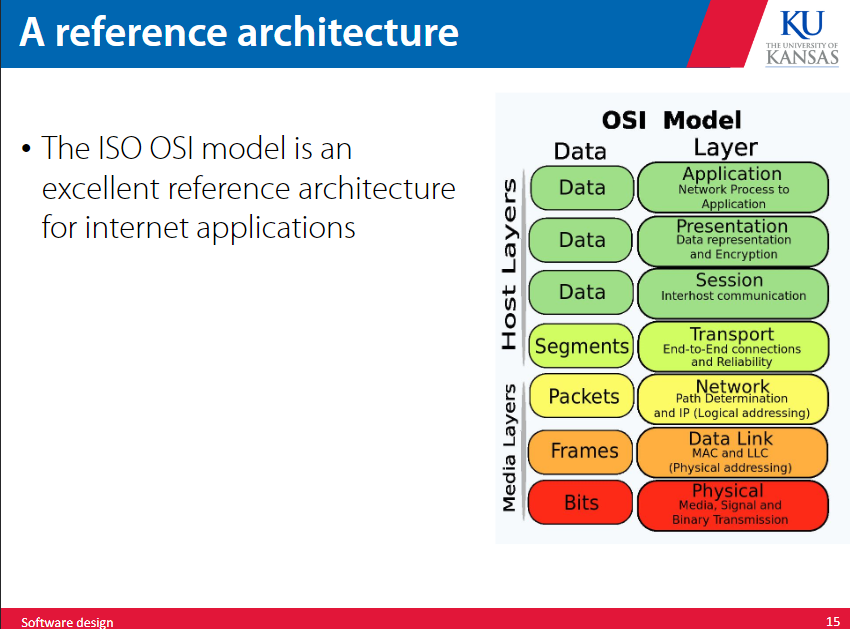
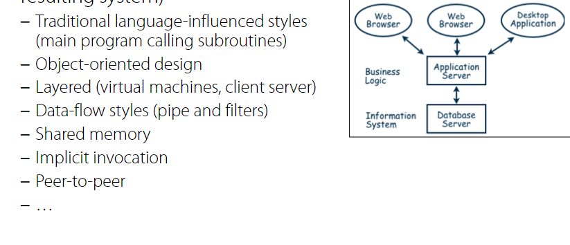
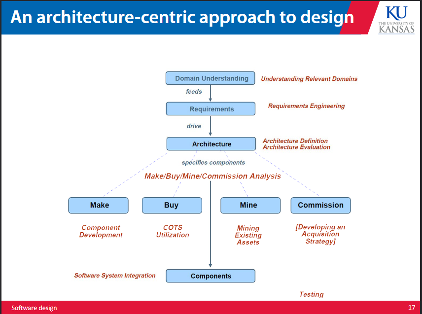
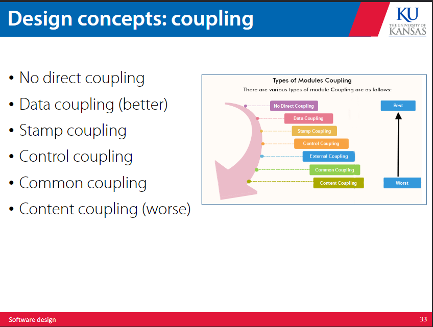
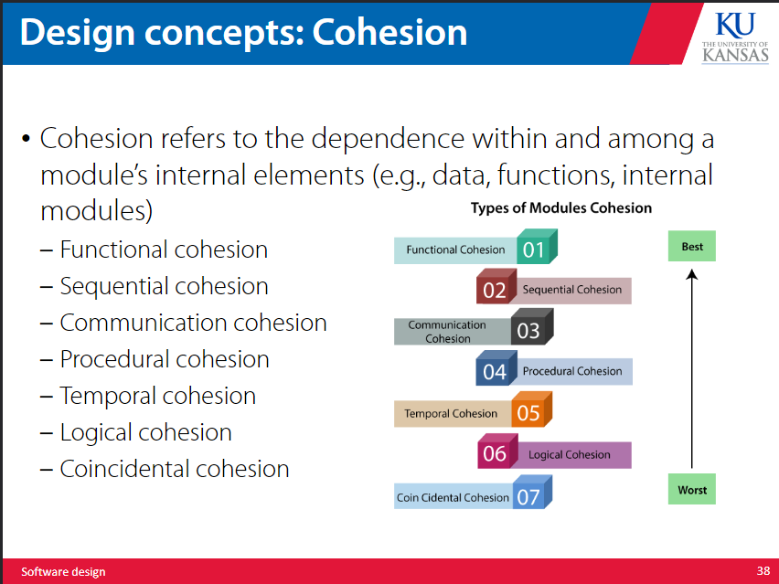
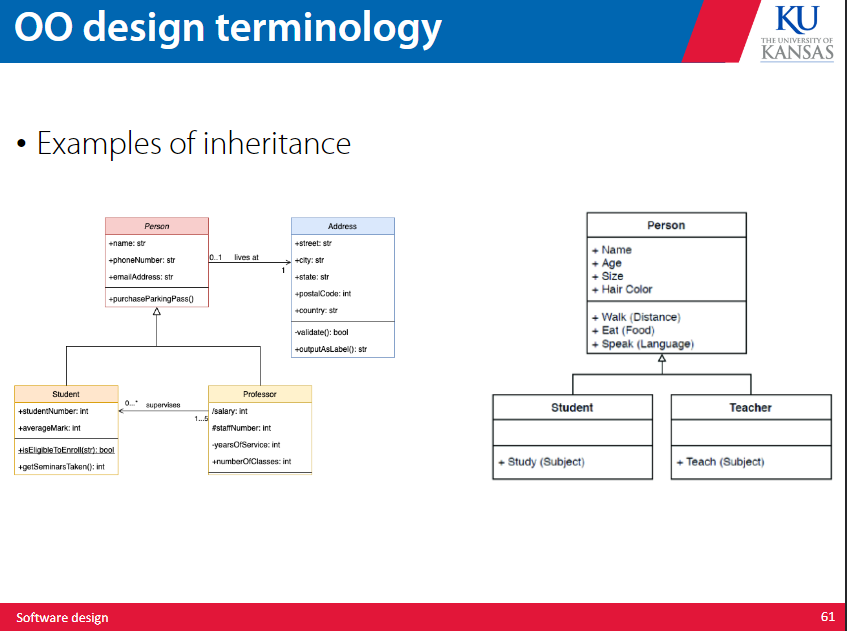
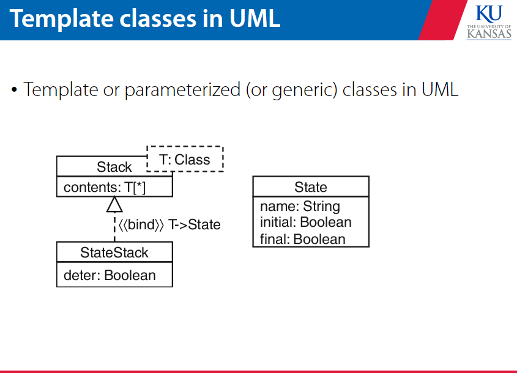
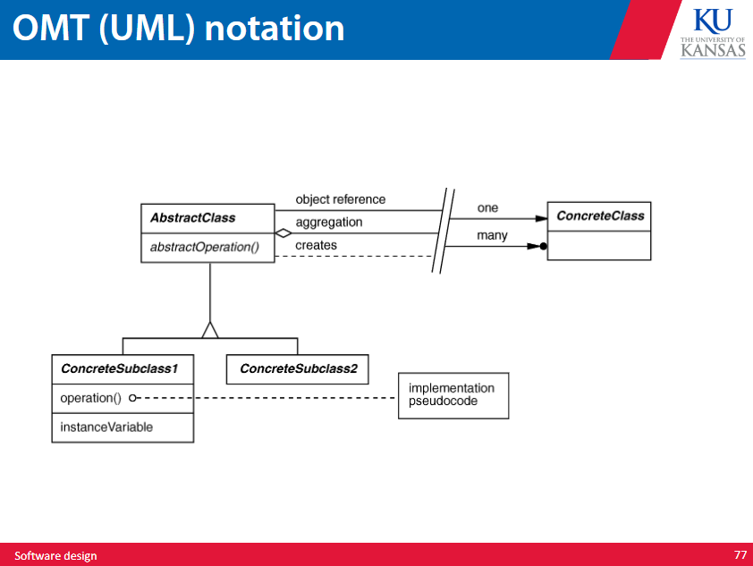
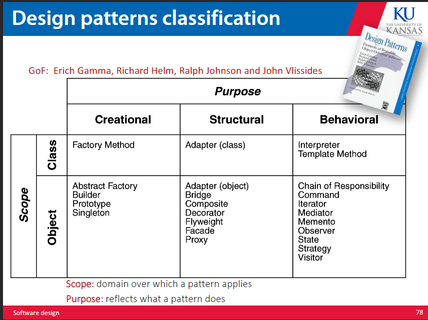

# architecture and design 

Now that we have the software requirements, we model the architecture of our software. There are many differeny ways to design the solution to our problem based on our specs. 

Factors that are important to consider in implementation: 

- easy to change algorithm 
- easy to change data representation 
- easy to change function 
- good performance 
- reusability 
- modularity 
- testability 
- security 
- ease of use 
- ease of integration 
- extensibility 

The architecture of the software involves the overall organization, the component decomposition, the server organization, and the tech used to build the software. 

The architecture is vital to the performance, usability, security, reliability, maintainability. 

## what is architecture 

architecture is the set of basic design decisions made about how a system is to be developed (especially how it is seperated into disparate parts). This is represented through software components, software connectors, configuration, and a rationale for the above. 

a software component is a box drawn around a subset of system functionality or data. This means everything in the box is locked within the box unless moving in and out through an explicit interface. This abstracts and encapsulates information, keeping things modular and ensuring components are discrete. 

## how to choose architecture? 

Three major types-- 

- domain specific software architecture 

this would create architecture specific to the domain the software is operating in, which allows for reuse of general structure and swapping of minor details and fucntionalities. This involves using a reference structure for the specific domain, which ideally encodes a lot of experience working in the domain within itself. 

- reference architecture 

- architectural styles 

an architecural style is a named set of design decisions that ideally introduce useful qualities into the final system by nature of the style. 

## architecture centric approach 

This basically just says after requirements we either make components, buy components, find them from existing assets, or commision them from elsewhere. Afterwards we integrate the components together to create the system. 

we can divide the problem by turning each system as a set of subsystems and so on. 

### developing architecture 

- choose a style 
- identify components 
- identify connectors 

then arrange them together lol 

### why decompose 

this makes management easier bcos work can be partitioned more clearly, ensures that module changes do not affect each other, and allow for bit by bit understanding of the system. 

## concepts 

### abstraction 

keep data and procedures abstracted, it keeps things simple and allows you to describe things

### seperation of concerns 

keep features seperated to improve modularity, functional independence, and refinement 

A concern here is a feature specified by the requirement model 

### functional independence 

each module addresses a specific subset of requirements and has a simple interface 

to achieve this it is important to have high cohesion and low coupling where cohesion is the interdependence of elements of one module and coupling is the interdependence between different modules 

### coupling 

this is an indication of the relative interdependence among modules, the more a module depends on another module the more tightly they are coupled. 

there are many ways modules can be dependent on each other: 

- references made from one module to another
- amount of data passed between modules 
- amount of control one module has over another 

coupling can be measured along a spectrum of dependence 

### cohesion 

cohesion is the dependence between internal elements of a module. 

- coincdental cohesion: the parts are unrelated to one another 
- temporal cohesion: the data and functions are related because they are used at the same time in execution 
- functional cohesion: all elements essential to a function are in one modue and all the elements are essential

### modularity 

this helps development, changes, testing, and long term maintenance. 

increase cohesion, decrease coupling 

generally good for decentralization of modules 

### decomposability 

turn complex systems in to subsystems, which is good for division of labor 

### composability 

build elements that can be freely combined to produce new software 

### small interfaces 

if two modules communicate they should exchange the least info possible 

it should be obvious from the two modules that are communicating that communication is happening 

### uniform access 

a modules facilities are accessible to its clients in the same way whether implemented by computation or storage 

things should always be accessible in one clear uniform way 

### information hiding 

whoever makes the module needs to choose a subset of properties that are official info that should be available to the authors of the clients. 

there should be a public interface in every module, and the rest is meant to be hidden inside the module without any ability to get to that information. 

### reusability 

make modules in a way that is easy to put into other applications or to grab parts that can be put in other applications 

object code can be reused, classes can be reused, and assemblies of related classes can be reused 

### refactoring 

simplify the code of a component without changing its function 

this is done to cut out redundancy, unused elements, ineffecient algorithms, poorly made data structures

### fan in / fan out 

fan in refers to the number of units that use a software unit 

fan out refers to the number of units used by a software unit 

### interfaces 

the externally visible properties of the software unit 

the interface spec should tell devs everything they need to know to use the unit properly 

- purpose 
- preconditions 
- protocols 
- postconditions 
- quality attributes 

### generality 

make the software unit as universally applicable as possible 

we can do this by increasing the number of contexts in which it can be used 

# object oriented design 

most design methodologies are object oriented, which decomposes a system into a collection of runtime components called objects. 

objects are precompiled entitites to be executed at runtime, that can have attributes that are other objects. an object implementation can be reused and extended with inheritance to define other objects.
they can also be polymorphic, so they can be work with objects of different but related types 

a class is a module that implements an abstract data type. if it is missing implementation for some methods it is an abstract class. classes contain constructors that create new instances of the objects they define. 

we can build new classes by combining component classes or by extended or modifying definitions of existing classes. this is called inheritance (where a new class is made by adding to an existing class)

## polymorphism 

polymorphism is basically just when there are multiple definitions of a code behavior based upon the input at runtime. there are multiple versions of any variable function or object based upon how they are being used. 

cpp types of polymorphism include:

- operator overloading 
- function overloading 
- template classes 
- runtime binding 

### operator overloading 

this allows for an operator to behave differently based on what it is operating on, eg adding two vectors or concatenating two strings for the + operator 

the left hand operand is the object that calls the overloaded operator when using a member function to overload an operator 

### function overloading 

the number and type of parameters determine which function is called 

### template classes 

this is a class that allows the programmer to work with generic data types which allows the classs to be used on many different data types without needing to be rewritten. 

instead of developing a stack for each possible input type, write a stack class is that is built to be generic 

### runtime binding 

pure polymorphism is binding at compile time, uses dynamic binding, and a subtyping relationship 

If S is a subtype of T, the subtyping relation means that any object of type S can safely be used in any context where an object of type T is expected. 

# design patterns 

a design pattern is a generally repeatable solution to a common problem. 

they include a name, a problem, a solution, and the consequences. 

## adaptor design

a module that allows the interface of an existing class to be used as another interface to allow for existing classes to work without modifying source code. 

## observer design 

a module that observes when a behavior of an existing class is triggered. you can define and add any mumber of observers. different observers can look at different things, and they can vary independently with the subject. 

