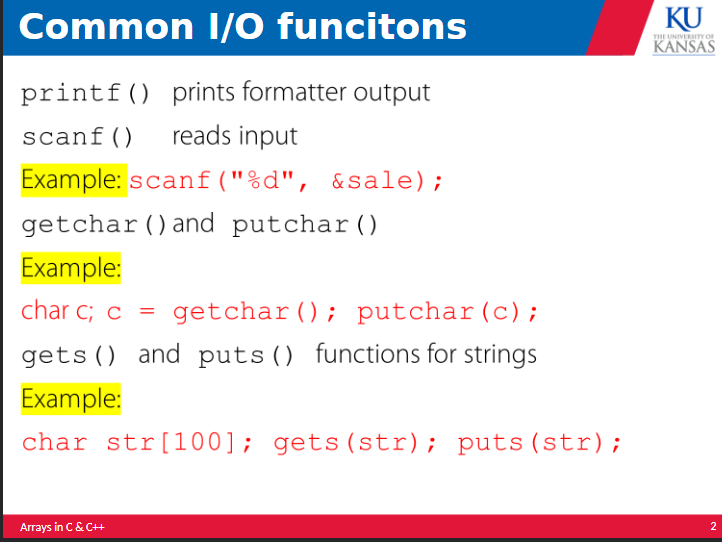
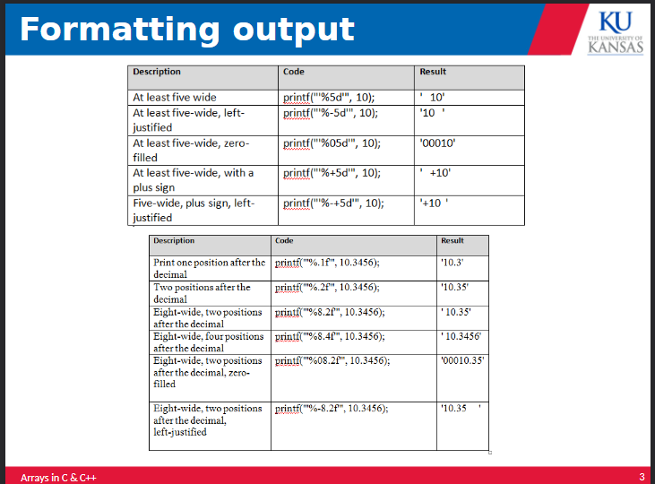
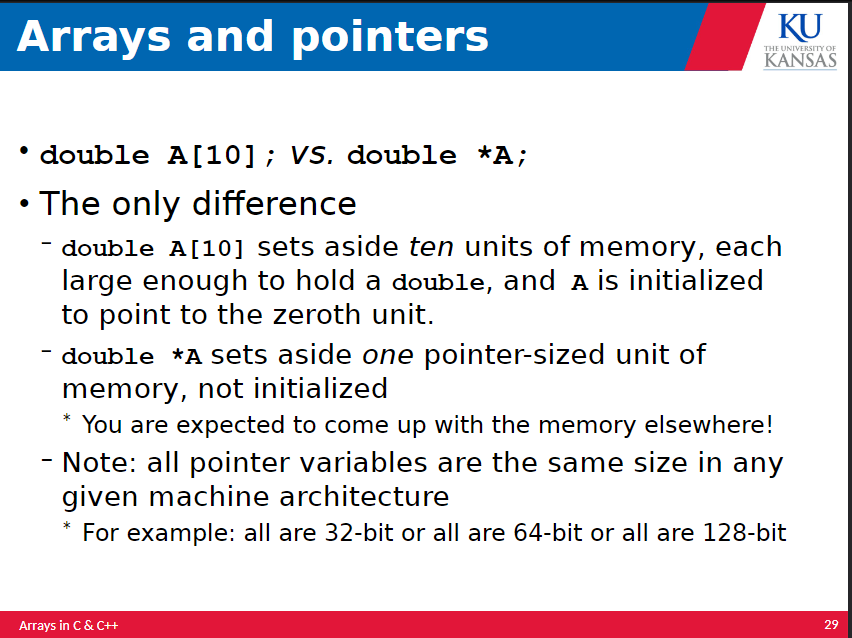

# Arrays in C/C++

## common i/O reference 





## Array 

An array is a collection of objects of the same type stored in memory under one name using multiple consecutive addresses. An array can be made using any kind of variable, and it can store other arrays. An array would be used to pass values to functions as a group or for ease of access to any value contained within the array. 

Arrays are the most commonly used data structure in C. They always index from 0, and can contain structs, unions, pointers, and most if not all variables. 

An array can be defined as a double array (models a matrix) and can be defined as an unknown number of a variable( allowed as a parameter of a function).

```C
int C[] // an array of unknown # of integers 

int D[10][20] // an array of ten rows containing 20 integers in each row 
```

### 2d Arrays 

A 2d array contains a one dimensional array of arrays. This way we can encode a row column structure. The second subscript in a 2d array varies the fastest, and the elements of the second subscript are stored contigously in memory. An array can also have 3 or more dimensions. 

### Array elements

These can be used anywhere a variable of the same type can be used. This inclused in an expression or on the left side of an assignment. 

In a generic form, 

```C
ArrayName[integer-expression]
ArrayName[integer-expression][integer-expression]
```

The array index is the expression between the square brackets. This can also be referred to as the array subscript. 

> C DOES NOT CHECK ARRAY BOUNDS 

It is your job to avoid indexing off the end of the array, bcos to do so is likely to corrupt the data, cause a segmentation fault, or expose a security hole. 

### declaring arrays 

Outside of a function, an array is defined statically, meaning it retains values across function calls. Static arrays are allocated in the static data stack. 

Inside of a function or compound statement, they are automatically created when the function is entered, and they are deleted when the function exits. 

Upon initialization, if an element is unspecified, it is guaranteed to be 0. If there are more elements provided than declared, the compiler will return an error. 

Dynamically allocated arrays can also be created with gcc, C99, and C++. This sets the zeroth element to 1 and all other elements are initialized to 0. This is written as follows:

```C
int E[n] = {1};
```

Size determination can also be done implicitly, giving it the same number as elements as initial values. For a static array, the values must be compile time constants, and for an automatic array the values must be runtime expressions. 

The sizeof operators can be used to return the number of bytes of memory required by the operand. This allows you to see how many addresses the array has reserved. 

> sizeof(type) returns the size of the type 
>sizeof array returns the size of the array object 
The size of an array must be able to be determined at compile time, and getting the size of a dynamically allocated array is not supported. 

## pointers 

Pointers are used all over the place. 

'&' is a unary operator generates a pointer to x. The operand of '&' must be a value that can be on the left of assignment. 

'*' is a unary operator that dereferences a pointer. This means it gets the value pointed to. It will pull the value at a memory address. 

A pointer is a variable that stores the address of another variable. These can be used to access the memory location of a variable, or pass the address of a variable to a function. 

You can also use a ** to define a pointer to a pointer. 

Pointers can be incremented or decrement, which will have that variable point to the next value of that type. Pointer can also be subtracted to return the number of values of that type exist between those two pointers. 


Arrays are essentially pointers, especially when used as the parameters of functions.

```C

p = &A[5]; is the same as p = A+5 
*p refers to A[0]
*(p+n) refers to A[n]
```

C does not assign arrays to each other. 

```C
double A[10];
double B[10];
A = B;
```
This assigns the pointer of B to the pointer of A. The original contents of A are untouched. 

### the difference 




### arrays as functions params 

```C
void init(float A[], int arraySize);
void init(float *A, int arraySize);
```

These are identical function prototypes, the pointer is passed by value. 

Caller copies the value of a pointer to float into the parameter A. Called function can reference through that pointer to reach the thing pointed to. 