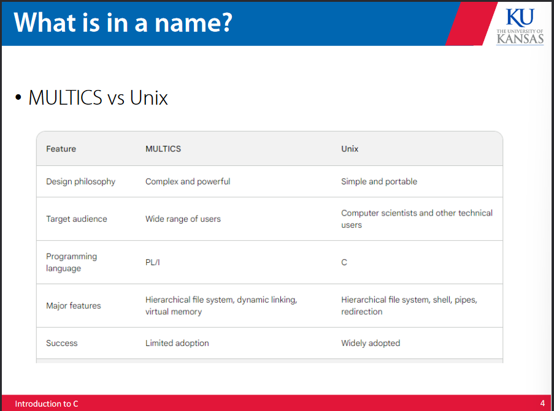
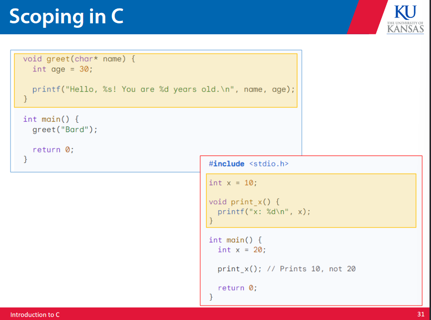
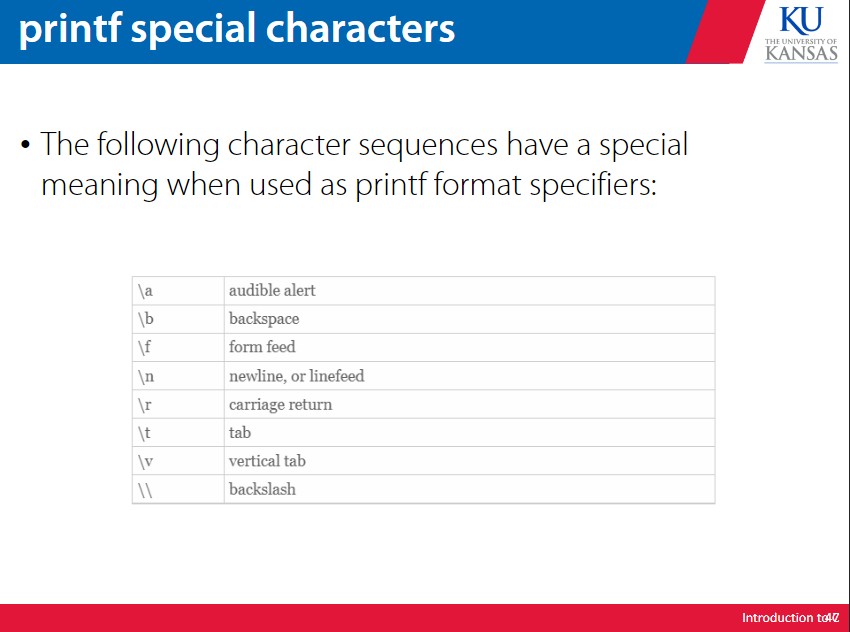

# C programming 

## background and history 

MULTICS stands for multiplexed information and computing service, it was an OS project by GE, Bell labs and MIT that was meant to be the most powerful OS, but it failed bcos it was too complicated. 

This led to the development of Unix by Thompson and Ritchie at bell labs. This was meant to be a simpler and more portable version of MULTICS. 



The primary programming language for the Unix operating system was C. The original planned langauge was called B (from BCPL or Basic Combined Programming Language). This was developed by Thompson at Bell labs in the 60s. This was a very small and simple language but it was limited and hard to use. 

C was the improved iteration of B created by Thompson and Ritchie at Bell labs. This is a very popular language that is sitll used today. C is both powerful and relatively easy to use. 

C++ was developed by Stroustrup in 79, and was meant to be the next iteration of C.

C++ is still being developed. The major difference between C and C++ is that C++ allows for classes where C does not. 

## C programs 

Generally in a C program one includes libraries, as shown below, to perform functions not defined by the user. stdio.h is a library that handles standard input/output behavior to the console. math.h is another common library.

```C  
#include <stdio.h>
```

These commands are essentially passing a directive to the linker that the header file as denoted by the .h should be linked to the file on compilation, so that all functions called by the program that contains the include statement are defined on call. 

C code must be compiled before runtime, to convert the source code to executable object code. The compiler catches any possible errors defined in the program as written. This necessitates that C has more rigid type and memory handling, but also increases efficiency and portability compared to languages like python that are compiled on runtime. 

The most common compiler is GCC, which turns the (relatively) high level code of the C langauge into an executable that will function on the ISA handed to the compiler. This allows for cross compilation as well. 

### common properties of C 

* case matters, but white space does not 
* comments go between /* and */ 
* each statement is followed by a semicolon 
* execution begins in the main function 


## the compilation process 

In the proccess of compilation, first the code is preprocessed and then compiled. 

In preprocessing, the soruce code is expanded by the linker based upon # directives. Ex: include pastes in the code from the header file included, define expands macros, comments are stripped out, and continued lines are joined. 

The compiler then takes this processes file and converts it into executable binary. 

## functions 

A function is a series of instructions to be run. A function receives arguments and returns a value. This value must be the same type as the function (unless the function type is void). A more accurate conception paints the type of a function not as the type of the function but as the directive handed to the computer that defines the expected return type of the function. 

Main is a function that is always run first, and a function must return a value unless it is a void type. 

Any argument passed to a function must also have a type associated. 

## memory locations 

Values are stored in memory as essentially a table of numbered slots that each have the storage capacity of a byte. Every memory slot is associated with an address. Each address can contain one byte. Some data values can span more than one address, like arrays or strings. 

An aside on strings -- C does not naturally have strings as a predefined type. This is due to memory size constraints. Strings can either be represented as array of characters or using the string.h function library. 

Multiple memory locations can be claimed in one variable declaration as an array. An example of this is the input:

```C
char [10]
```
This input creates a 10 address array of character values. This command could be used to create a string variable. 

## libraries 

C is a lightweight language, so many common functions are stored in libraries. As mentioned earlier, this includes  the stdio.h and math.h libraries. 

Many libraries carry dependencies on other libraries, that would require that those base libraries are also included in the program for the dependent libraries to function. 

## types 

Common C variable types include: char, int, float, and double. Any variable must be declared before it is used. A variable declared without any value will create a reserved memory location that contains nothing, but a variable declared with an expression will contain the value of the expression at the memory location.

A variable essentially names a memory address that contains a value of a certain type. The compiler reserves a space in memory that corresponds to that variable name. This is what will lead to issues in C regarding memory location vs value. 

## evaluation 

C follows standard algebraic operator precedence, and converts symbolic variable names to their values on combination. 

Comparators return boolean values, but it is important to note that any value other than 0 evaluates to True in C. C also follows boolean algebra conventions that improve efficiency.

> 0 means False, and any other value means True

In keeping with its ability to function in boolean algebra, C contains bitwise operators, that operate on the binary value instead of the logical value contained within the binary value. 


> if in division the second argument is an integer, the result will be a rounded integer and not a float. 

## assignment 

Variable assignment stores a value in the memory location of a variable.


The above conventions allow for smoother assignments than having to create an intermediary variable. 

## scope 

In C, the scope of a variable is dependent upon the compound statement or {} that it is contained in. The machine will use the value stored in the most global compound statement. 



## control flow 

### if 

```C
if(expression) statement;
```

If an expression is not 0, the statement is executed. If not true, it is not executed. Multiple statements can be made inside of an if statement using {}.

### if/else 

```C
if(expression) statement1; else statement2;
```

if the expression is true, execute statement 1, otherwise execute statement 2.

### assignment operators 


> pay attention to pre or post increment/decrement
### while 

```C
while(condition) statement;
```

the condition is evaluated, if it is true, the statement is executed

### for 

```C
for (expr1;expr2;expr3) statement;
for (intialization;test;increment)statement;
```
The for loop first does the initialization, then as long as the test is true, it will execute the statements,then increment. 

The for loop is essentially shorthand for a while loop structure.


# printf references 





