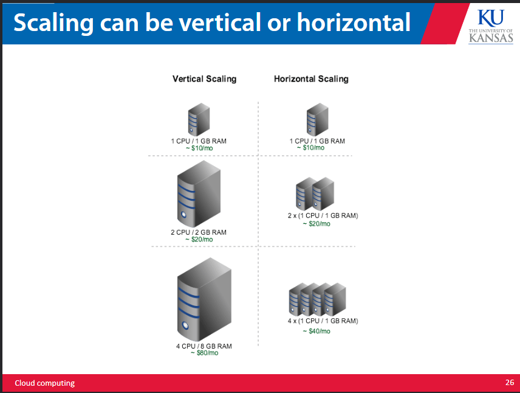
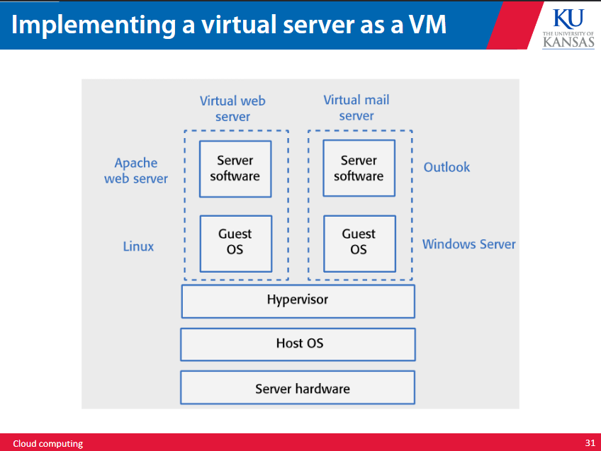
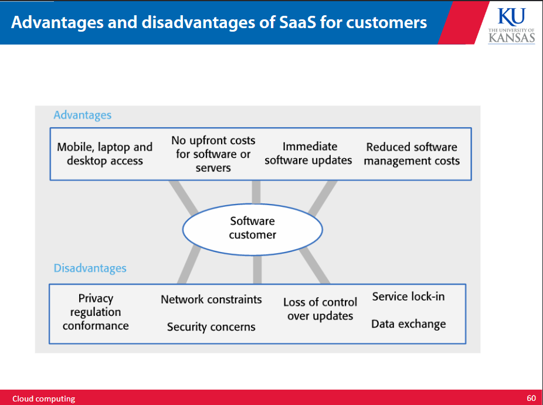

# cloud computing 

Computers were initially just mainframes with terminals, and we connected to the central computer to do individual tasks that were all handled by the same computer. This meant the computer was slower, as it had to share computing time amongst tasks between all of the different terminals running at the same time. 

We managed to make minicomputers as our memory storage mechanisms got smaller and more efficient. These were meant to be cheap, portable, smaller than a mainframe, and interactive. 

Then comes PC's which were much smaller, easy to mass produce and were meant for personal use. 

After that we make the internet to allow computers to communicate. Once it got big we made Server PCs that live in data centers for storage and relay. Data centers require a lot of energy, money, and time to build and maintain. These generally require some specialized skills to manage, so data centers were a little prohibitively expensive. 

They require huge amounts of electricity and are often placed in cold areas to save on efficiency costs. 

## how the cloud works 

We fix these issues by outsourcing data centers. By essentially renting data center space, time, and computing power, we can lower the bar to entry. This allows for computing to be a fungible commodity that those who own data centers can trade. 

A cloud is just a data center that is used to offer computing resources and services to others without direct management by the user. 

Usually cloud computing involves web apps, or databases that exist elsewhere, and provides servers, storage, databases, networking, software, and analytics. 

Remote servers are virtual, and are not actual hardware servers. Cloud hardware nodes can simulate multiple servers at once and allow for 'servers' to be created and released on demand. They allow you to pay for only the time you need on the hardware.

## scalability elasticity resilience 

### scalability 

scalability is the ability of software to handle large numbers of users. Cloud computing is especially good for this as it allows your software to grab more resources as it needs it, as the server it is running on is virtual and not actually limited by hardware. 

### elasticity 

elasticity is the ability to scale down as well as up. The more elastic your software the more efficient its resource use. Cloud computing is again good for this as the demand on your software can be monitored and the cloud systam can dynamically adjust the amount of virtual servers it is using based on the demand. 

We can also refer to this as scaling up and scaling out. 

### resilience 
Resilience is the ability of your software to tolerate server failures. This means that if one server fails another can pick up the slack to keep the service running. This can be done with redundant servers. Cloud computing allows us to dynamically create copies of servers so that instead of having to maintain and run a duplicate server, it can be picked up by the cloud management service. 

## why cloud 

Cloud computing saves massive amounts of money, time, and decision cost up front. It also allows for distributed development, as those working on the service can work through the cloud service to seamlessly share information without having to work directly with a physical server. 

Here a hypervisor is a software, firmware, or hardware that allows you to run multiple VM's on the same physical machine. 

A host machine is a computer that is using a hypervisor to run virtual machines. The virtual machines are called guest machines. 

We can either run hypervisors directly on hardware or as an installion on a host OS. The virtual server allows us to create multiple virtual OS's to run multiple applications on different OS's at the same time all on the same actual server. 

## containerized software 

Normally we make software for specific hardware, OS's, or apps that run on top of OS's. Every software has its own set of libraries and dependencies, which may involve different versions of the same library. This becomes an issue as we need to run these different systems and softwares in tandem. 

The solution to this is containerization. By creating containers we can create virtual environments for each individual service that allows us to easily move the container between devices. As all the libraries and dependencies for the service are contained within the container, the service will not clash with any other service or run into issues with OS compatibility. 

These containers or "packages" allow us to move between virtual environments as we please without any of the many issues we would normally have with this. 

Containers are ideal for the cloud environment as they are much smaller and faster than virtual machines. 

## as a service 

The core of cloud computing is that we can now make things "as a service". We can rent these services to others instead of requiring others to own them. This means we can rent out infrastructure, platforms, and software to users to reduce start up cost. The more things that are a service the more are managed by the provider and the less are managed by the user. 

Look at the slides for more examples on what each type of service providing entails. 

infrastructure: 
offers computer service, network service, and storage service that can be used for virtual servers 

platform: 
provides everything infrastructure does + libraries and frameworks 

software:
provides everything, runs on the cloud and is accessed through a web browser or mobile app 

Software is being sold as a service instead of a product much more, using a pay as you go subscription model that does not require installation on a host device. Using this model allows for more adaptive response to user demand and long term profit based on use instead of unit sales (also makes it harder to steal software). 

SaaS is generally good for continous cash flow, control of product updates, and continous deployment of features and bug fixes. This also allows for payment flexibility, trial periods, and better data collection on users (allows for customer data and usage to be tracked easier as all data is running through the cloud network). 

