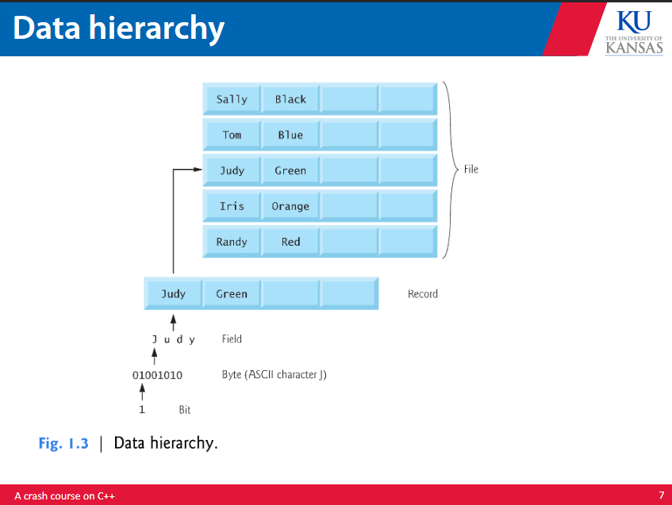
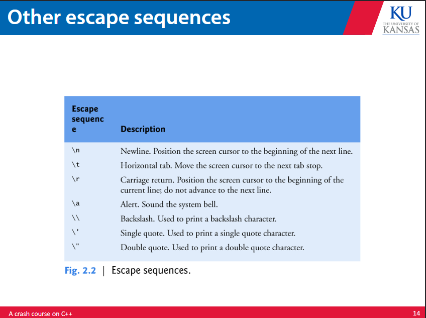
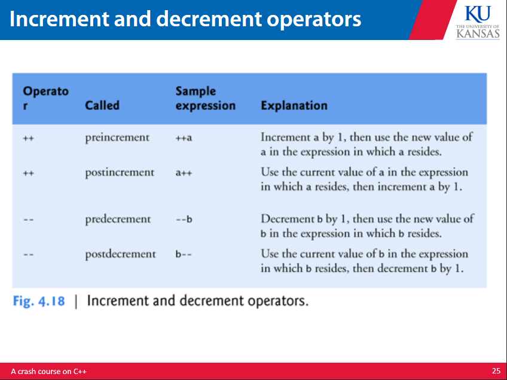
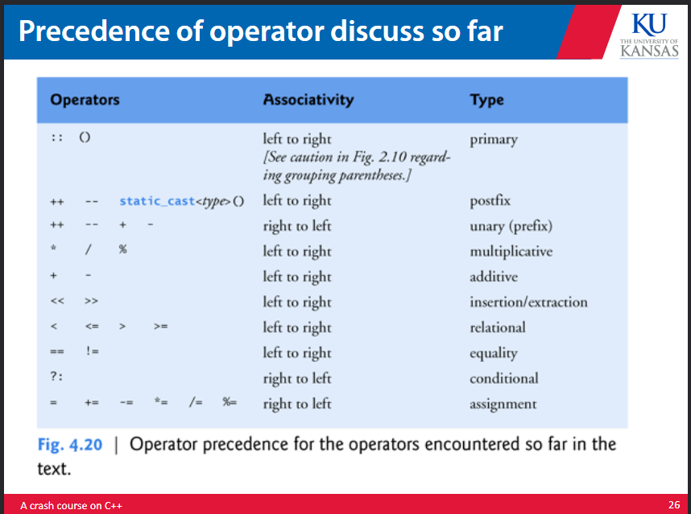
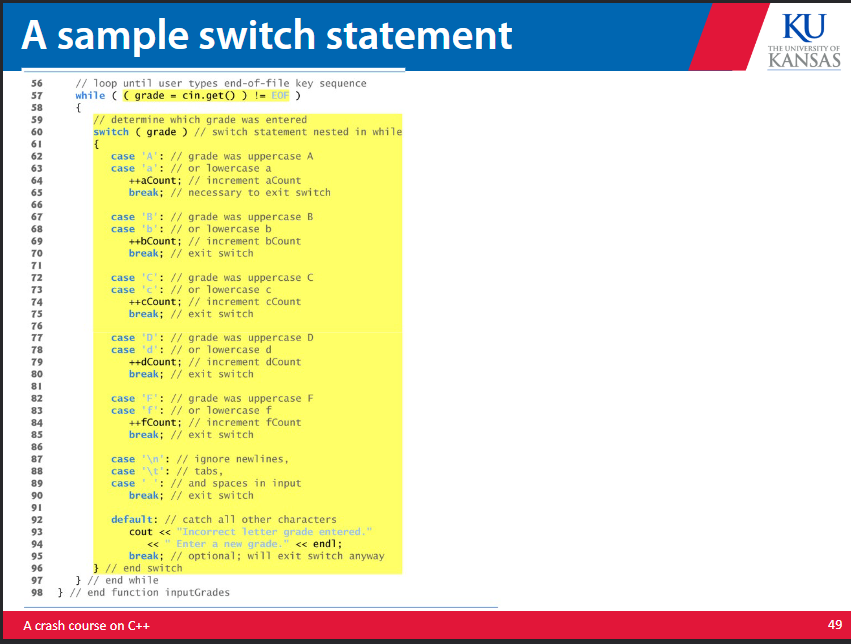
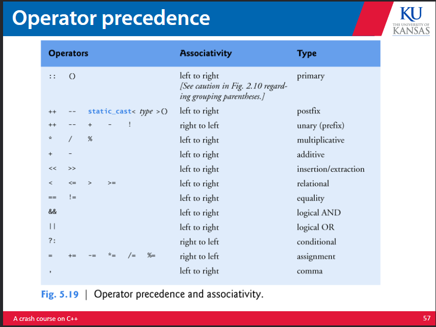

# C++

Note that this document will ignore anything that behaves more or less the same as it does in C. Refer to c.md to find those notes. 


## object orientation 

c++ programs contain classes and functions, as the language was created to 'expand' C to allow for object orientation. Object orientation is useful from a software engineering standpoint as it allows for easy software reuse. The standard library functions allow for ease of use and compatibility with 3rd party external libraries. 

Compilation of a high level language can take a considerable amount of computer time, so interpreter programs were made to execute high levels directly without need for compilation. Most scripting languages are processed by interpreters. Python also uses an interpreter. 



Classes carry attributes, methods, member functions, and are either defined as public, private, or protected. Encapsulation is a concept in object oriented programming that allows for information hiding, and is the basis of the public, private, or protected qualifier to any class method, function, or attribute. 

Classes can also be defined as subclasses of other classes, allowing for both single and double inheritance of attributes and methods. For example, a square could be a subclass of a rectangle, as it is a subset of a rectangle. It would carry the same base attributes as a rectangle, as it is a subset of a rectangle, and thus inherit those attributes. 

Polymorphism is the ability of any object method to have a different type on function call. This allows for two or more different versions of a function to be defined that allow for different argument types, that the compiler looks for and verifies upon compilation. 

## programming 

```cpp 
// indicates a single line comment 
/* */ indicates a multi line comment 
# is a directive to the preprocessor 
#include <iostream> // is for iO
white space is ignored
```

Typicall iO is handled with streams of characters. cout sends a stream of characters to the std output stream object std::cout. 
Normally this is connected to the screen. 
std::cout is using the name cout from the namespace std. Other names that belong to std are cin and cerr. 

\<< is referrered to as the stream insertion operator. This inserts the operator to the right of it into the output stream. \n denotes a newline escape sequence. This causes the cursor to move to the beginning of the next line on the screen. One can concatenate stream insertion operators to chain them into cascading stream insertion. If a newline escape character is not sent to the output stream, all outputs from cout will be chained together, ie on the same line. 



The return statement operates the same it does in C. It is good to note that if a return statement is not encountered by the end of main the program is assumed to have terminated successfully. 


Operators, fundamental types, and variable/function identifiers operate the same as they do in C. Precedence also functions the same. There is no exponentiation operator, so square must be stated as x*x. Relational operators work the same as in C. Assignment operators work the same as in C. 

The statement 'using' can be used to eliminate the need to refer to the std namespace every time a stream operation is called. This can also be defined as ' using namespace std' to cut this need for all std named operations. 






## control flow 

Normally statements execute sequentially. All programs use three basic control structures: sequence, selection, repetition.

c++ has three selection statements: 

* if -- either selects an action if a condition is true or skips the action 

* if else -- either selects an action if a condition is true or does a different action 

* switch -- performs one of any num of actions based upon an integer expression value. THis is a multiple selection statement bcos it selects among many different actions. 

c++ has three repetition statements:

* while -- perform the action while a condition is true 

* for -- perform the action while a condition is true, and change the condition after each action 

* do while -- perform the action then check if the condition is true, if condition is true perform the action again (essentially this does the body of the loop then behaves like a normal while loop)


### if 
An if statement can be based on any expression, if it evaluates to 0 it is false, and if it evaluates to anything else it is true. c++ has the data type bool for variables that can only hold the true or false keywords. If else statements can be chained to perform specific actions based on multiple conditionals. This behaves similarly if not the same to python. The dangling else is a problem you can have if your conditional checks are not properly contained within {} brackets. This would chain an else to a different if than intended when doing nested ifs. 

A null statement can be placed anywhere there is a statement, and is denoted by ; . 

### for 

The for statement can be seen as essentially a counter controlled while loop that increments the control variable in the while loop. The for loop does this in a single line of code, and behaves the same as it does in C. 

It is important to note that the expressions in the header of a for loop are not required but the for( ; ; ) seperators are required. If there is no loop condition, c++ assumes the condition is true, making an infinite loop. If there is no initialization condition, the variable will have had to have been initialized earlier in the program. If there is no increment expression, the increment may either be calculated by statements in the body of the for loop or if no increment is needed. 


### do while 

The do while statement operates very similar to the while statement but it tests the loop continuation condition after the loop body executes, so the loop body always executes at least once. 


### switch 

The switch multiple selection performs many different actions based on possible values of a variable or expression. 


Switch has a series of case labels and an optional default case. The statement compares the control value to the expression with each case label, and if there is a match it executes the statement. break if used to cause the switch to exit and have the program proceed with the first statement after the switch. Listing consecutive cases with no statements allows both cases to perform the same set of statements. A case can have multiple statements, and does not require a {} block around said statements. 

If a break is not used, each time a match occurs in the switch, the statements for that case and subsequent valid cases execute until a break statement or the end of the switch is encountered. 

If there is no match between the control variable value and any case statement then the default case executes. If there is no default case, the program continues past the switch. 


### break and continue 


Break can be used in a while, for, or do while loop to immediately exit the statement. 

continue can be used in a while, for, or do while loop to skip the remaining statements in the body of the statement and proceed to the next iteration of the loop. 

In a while and do while statement, the test happens immediately after the continue statement. 

In a for statement, the increment expression executes, then the loop continuation test evaluates. 

### logical operators 

c++ has logical operators used to form more complex conditionals. This includes &&, || , and ! ( all of which correspond to their python counterparts). 



## code structure 

It is easier to work with a program that is structured. duh doy. 

### function prototype 

This tells the compiler the name, data type returned, number/type of paremeters received, and order of paremeters for any given function. 

The part of the function that has the name of the function and the types of the arguments is the called the signature. The areas where the function is known and operable is the scope. 


### headers 

Headers contain the prototypes for all related functions from the library. Headers also declare class types and constants. 

### storage classes 

Extern and static are both keywords that declare static storage. They exist and are constant from the beginning of the program execution until the program ends. 

Externs are visible from the outside of the file and statics are only visible within the file they are declared in. Local static variables are only known in the function they are made in but retain their values when the function returns to its caller. The next time the function is called, the static variable will retain its behavior from when the function was last called. 

### scope 
Scope can be of four types:

- block scope 
- function scope 
- global namespace scope
- function protoype scope 


We can create functions with empty parameters by putting nothing between the parenthesis or putting void. 

### inline functions 

We can also create inline functions to reduce overhead of function calls. Putting the inline before the return type tells the compiler tot make a copy of the code every place the function is called. 


### reference parameters 

We can pass arguments to functions either by reference or by value. 

When passed by value we are passing a copy of the value we passed to the function. Changes to this copy do not affect the original value. We can also put the const qualifier before the type specifier in the parameter declaration.

When passed by reference we are passing the pointer to the actual memory location that contains the value. This accesses the direct data and allows for modification of the value at the memory location. We indicate this by following the type in the function prototype with an &. We also use the same convention when listing the parameter in the function header. 

### unary scope operator 

You can declare local and global variables of the same name. The scope operator :: in cpp allows you to use a global variable when a local variable is in scope. 


### function overloading 

We can declare multiple functions of the same name as long as they have different parameter signatures. This allows us the compiler to pick the proper function based on the number, type, and order of the arguments in the function call. This way we can make several functions of the same name to perform similar tasks. 


### function templates 

If the logic and operators are the same for a data type, we can use function templates. The template keyword followed by a template parameter enclosed in angle parameters allows for a single function template definition. This way we can make a template for multiple data types. 

## object orientation 

Classes define a data structure and a set of operations. It also indicates which of the above are public, private, or protected. 

Each class has some public and some private variables that are defined in the constructor. We can define what functions and paremeters are acessible in this constructor. 

Public: accessible where the program has access to an object of the class

Private: accessible only to member functions of the class 

we can access members of a class using . for objects and -> for pointers. 

### constructors and deconstructors 

constructors are member functions that create instances of class objects. They by nature cannot return values and have the same name as the class.

destructors are a special function with the same name as the class but preceded with a ~. This cannot be overloaded or take any arguments and it performs the housekeeping of terminating an object. 

we can initialize member variables in the constructor or set them later. When we initialize, we pass the constructor arguments that get turned into the member variables on construction. We can also pass default arguments. 


