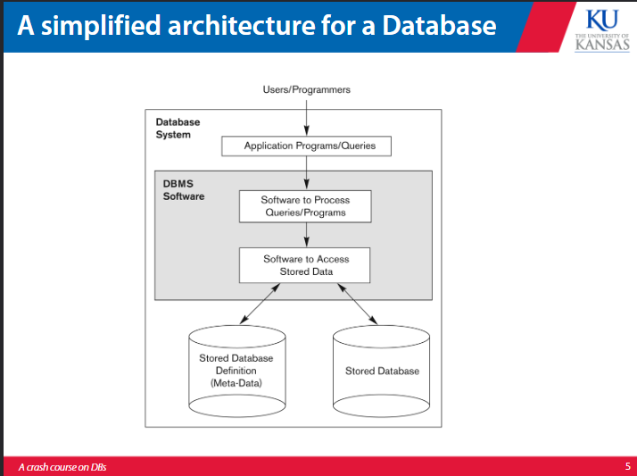
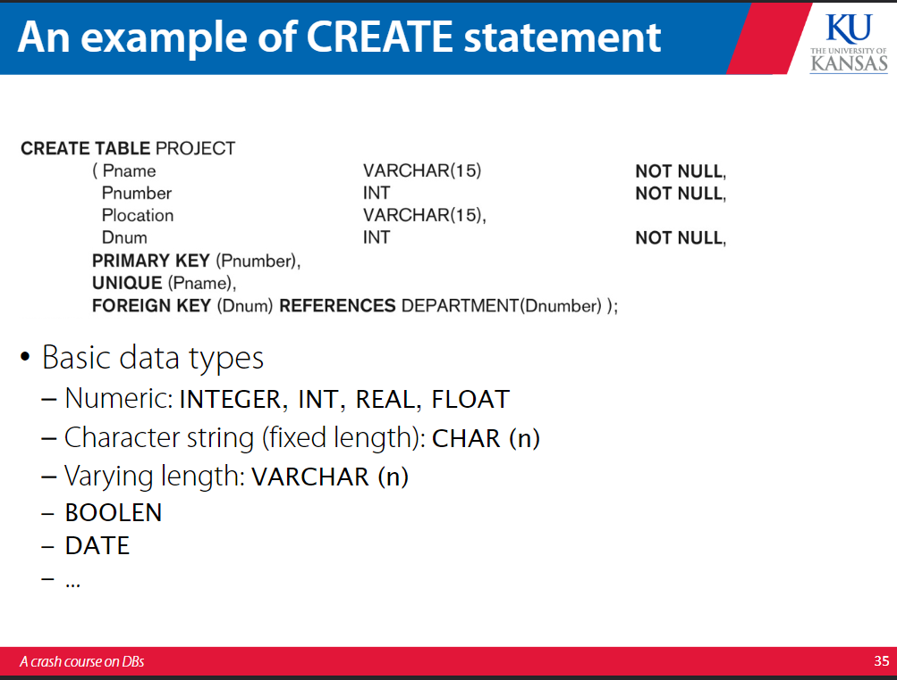
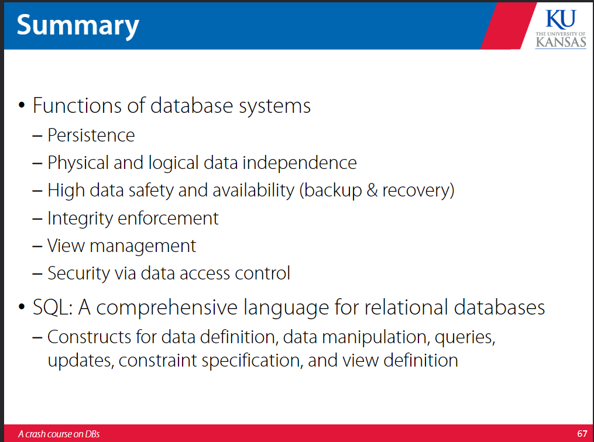

# database design 

DBMS is a set of programs that contains a collection of interrelated data, a set of programs to access the data, and an environment to interact with this. 

Database systems are used to manage large collections of data that are accessed by multiple users and apps at the same time. 

A DBMS essentially just lets you communicate with a database as a user, dev, or application.

The relational model puts each entity in the database as a row where each column is a type of category in the database. 

## database languages 

There are data definition languages (DDL) that are used by the DBA and the designers to specify the schema of the database and define what views can be made and data manipulation languages (DML) that are used to specify modifications to or retrievals from the database, which can be embeded inside other general purpose programming languages. 

DBMS interfaces include query languages like SQL, interfaces for embedding DMLs in programming language, user friendly interfaces, and natural language interfaces. 

### SQL 

Stands for structured query language. Allows for data definition, schema definition, data manipulation, transaction control. indexing, security specific active databases. There are variations of SQL that exist in DBMS already. It allows for base relations and views (relations that are virtual, or not actually predefined relations in the DBMS). 

## commands  

In this Dnum is a key coming from the category Dnumber in the Department table. Pname is a key unique to the Project table. 

Insert puts a row into a table, where the values are listed in the tuple in the same order as were specified in the creation of the table. 

Update modifies attributes of one or more tuples. 

Delete removes tuples from the relation. 

Select is the core of the SQL language. It embodies the principal data language operations. 

Select iterates over rows of tables, filtering based upon conditionals provided by the user. It computes over column values and constructs literal tables. It also can group or aggregate values in a column. 

In a select-from-when statement, SQL pulls from the tables to be pulled from, filters them based on the where condition, then selects those that fulfill the condition. 

In a group by statement, SQL pulls from the tables to be pulled from, applies the where condition filter, groups the results by the grouping expressions, aggregates them, then selects them. 

The Having clause is like a where clause that can work post aggregation. 

The Order by clause is a means of ordering the output of a query.

## referencing 

In general, attributes are referred to as the table they are a part of dot the attribute name. 

e.g. : Select S.lastname From Students S 

This convention is not necessary when there is no ambiguity. 

## summary 

