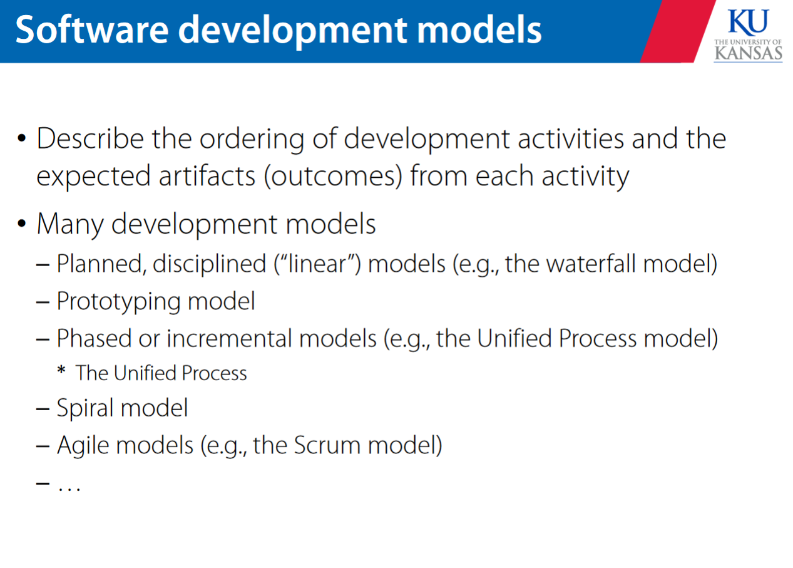
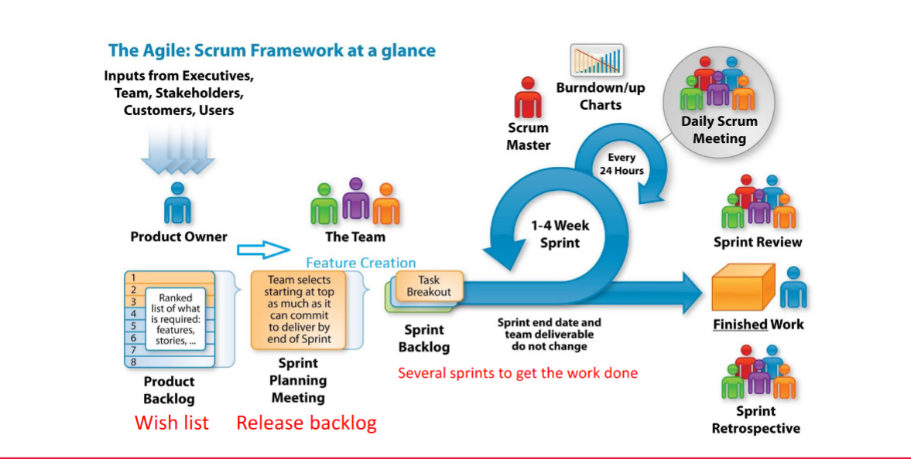

# software dev process models 

*process* - a set of activities that are planned and performed to achieve a given purpose and includes: roles and responsibilities, tools, procedures and methods that define how to do the tasks and the relationship between the tasks 

why use processes -- they provide structure and consistency 

there are 4 major activities in the software dev process 
 

requirements engineering  
design   
coding/ implementation  
testing  

> requirements engineering 
> > requirements analysis  
> > system requirements 

requirements engineering involves elicitation, analysis, modeling, and validation 

design involves architectural , data structure, component, and interface design 

## waterfall model 
good for well understood models that have few requirements changes 
each phase has a defined deliverable but there is a long wait for final products 

## incremental/iterative model 

starts with small functionality, adds new functionality with each release 

starts with the full system with minimal detail but enhances the capability of each component with each new iteration 

## agile models

these are both incremental and iterative 

scrum is a popular agile model 

# scrum 

important scrum concepts 
> team roles  
> product backlog   
> sprints  
> burndown charts  
> estimation techniques   
> sprint retrospectives 

*product owner* - sets direction, makes sure the right features get in the release 

*scrum master / project manager* - ensures the project runs smoothly, ensures team members have the right tools to get their jobs done, sets up meetings and plans and releases 

*devs, testers, customers* - parts of the scrum system 

# developing 

