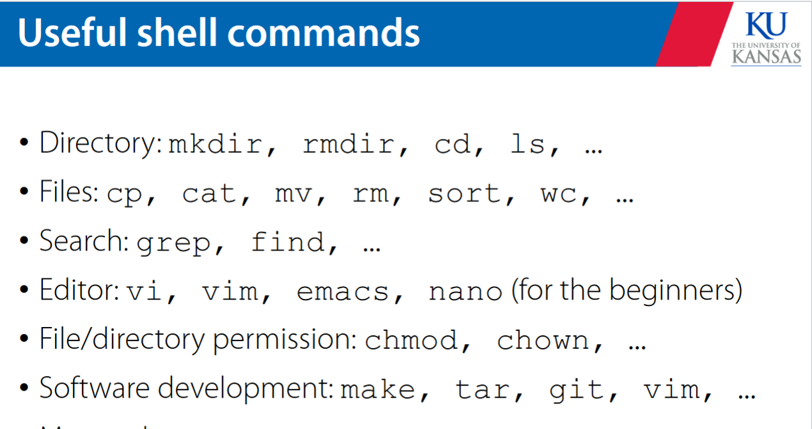
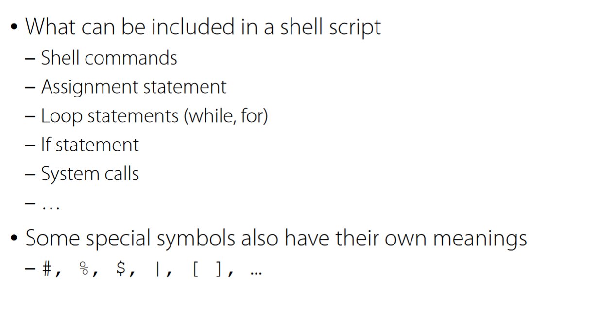
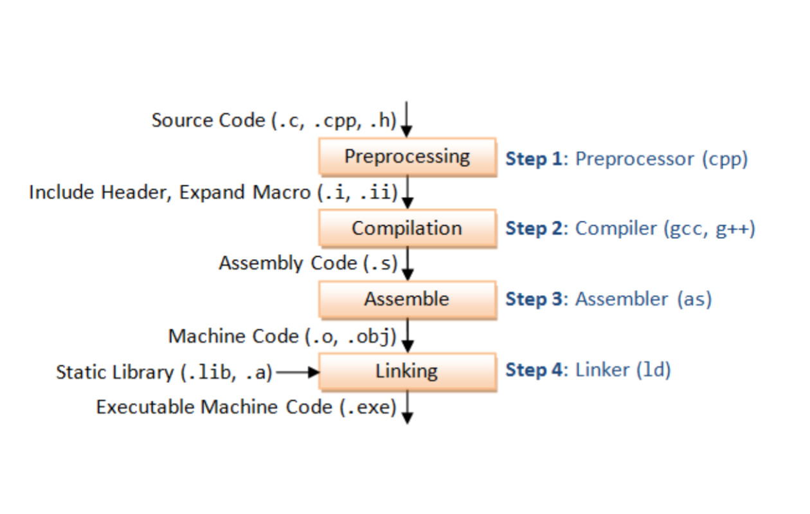

# software development tools 

## git 
you know what git is and how it works already but i might as well fucking write it down 

git stores snapshots of changes instead of making complete copies 

github is gui that allows for remote repos and the pulling of repos to different machines.
good for collaborative activities between different machines that are not related by a server

## shell 

you also already know how CLI's work 

the CLI lets you input commands that are sent to the shell that translates them to the kernel to be completed 

the shell exists between the user and the kernel 

in the shell aliases can be assigned to give a new name to a command -- you do also already know how this works 

the bash config file is .bashrc 

you can use the shell to write shell scripts that will automate commands. this can automate the compilation process and the execution of backups 

## IDE's 

a comprehensive editor/builder/debugger 

IDE's generally have syntax highlighting and help with editing, have packaging options, allow for posting to an online repo, configurable build support, and smart feedback. 

## compiled programs vs interpreters 

interpreters throw errors on runtime whereas compiled programs catch errors on compilation 
 

compilation is essentially the translation of source language into target language before runtime which allows for faster operation at runtime and a lower likelihood of errors 

make file can be used to manage the compilation process 

> in simple terms an interpreter produces a result from a program while a compiler produces a program in assembly from source code 

the assembler is what translates the assembly into binary code based upon the ISA of the machine 