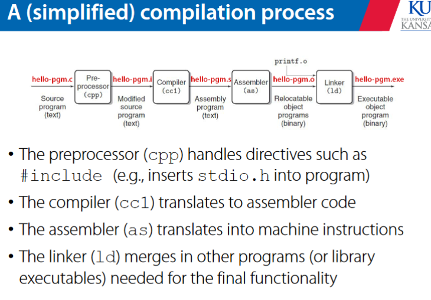
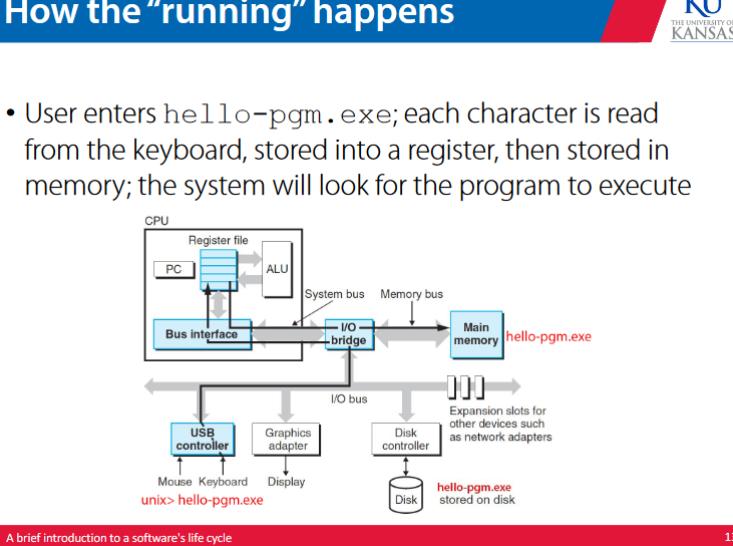
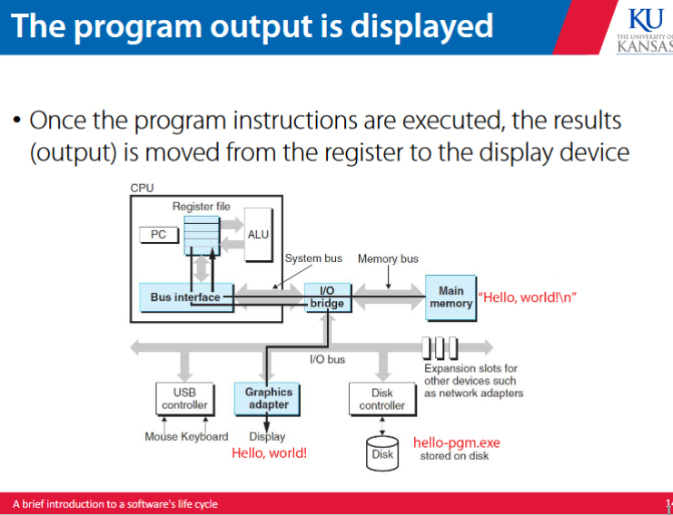

# software life cycles 

software has three life cycles -- development, maintenance, and runtime 

in software engineering we are mostly focusing on the development life cycle
 
*requirements engineering* 
-- to identify, model, analyze, document, and validate the requirements 

*design* 
-- to develop a software solution that adresses the requirements

*contstruction*
-- to convert the design into code 

*testing* 
-- to conduct various testing techniquesto identify and remove defects 

different models of development define the specific ordering and steps of these 

software engineering also emphasized the maintenance life cycle 

## 4 types of maintenance 

*corrective* : to remove defects 

*perfective* : to add new features 

*adaptive* : to adapt to changes 

*preventative* : refactoring to prevent issues 

## what happens at runtime?

most characters are stored as ASCII that is represented as binary when sent to the compiler 

to run it through the command line we enter the .exe file 

when we enter that command, each character we input from the keyboard is read, stored into a register, then stored into memory, and then the system looks for the program to execute based on the command 

once the instructions are executed, the output is moved from the output register to the display device

# why teams

most systems in industry are designed and implemented by teams of individuals 

