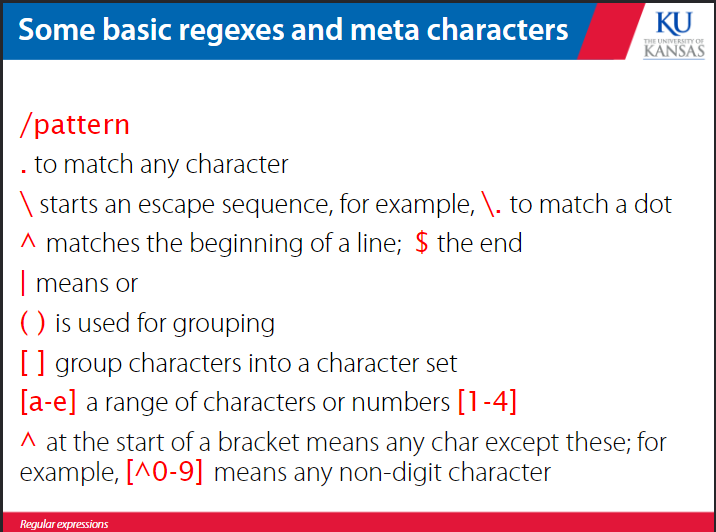
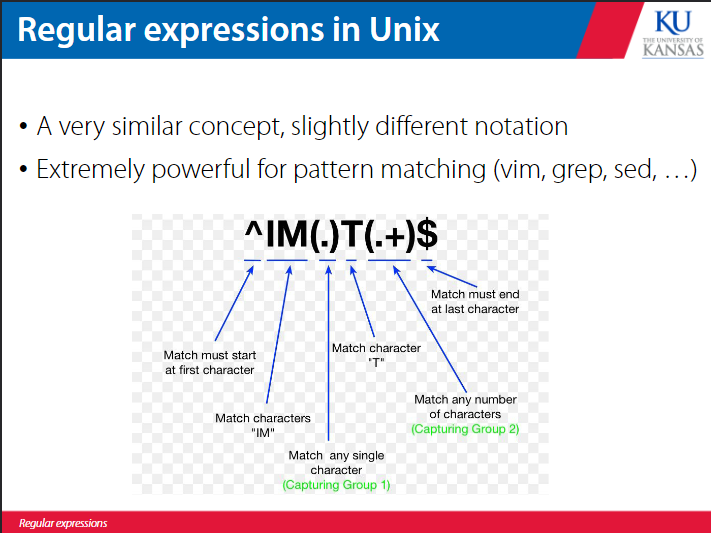
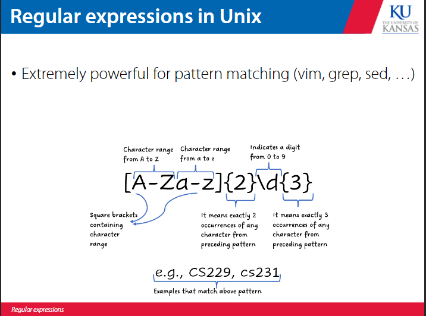
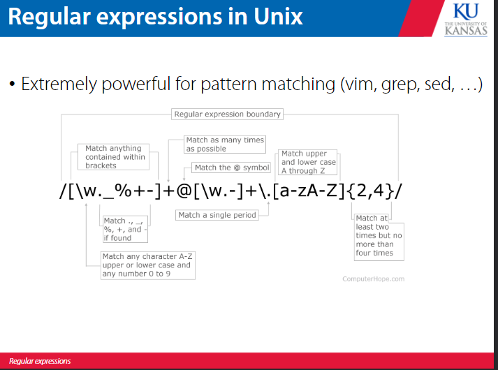
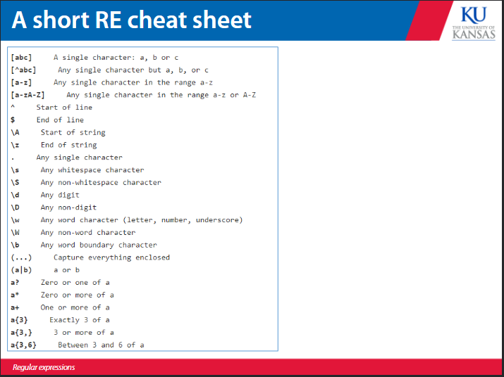
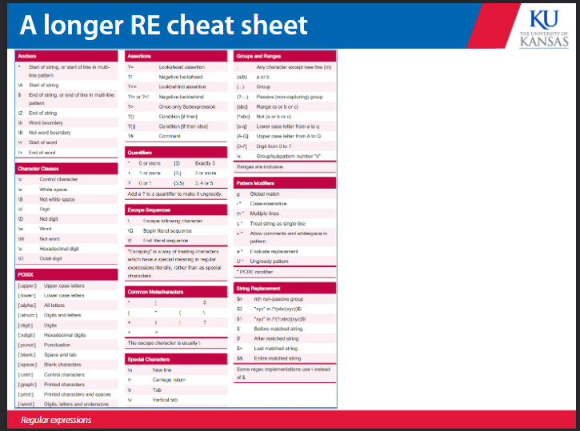
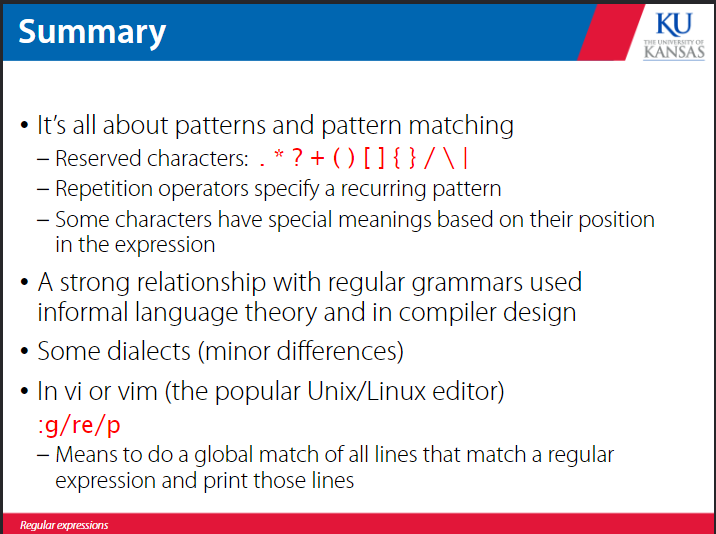
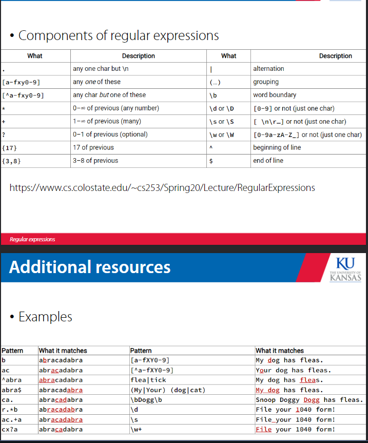

# regular expressions 
TBH this file will be a lot of screenshots of behavior 


a regex describes a pattern of text for matching or to search and replace. this can be used in text editors like vim, unix command line, and in languages like python and javascript. 




```regex 

. matches any single character

^ checks if a string starts with a certain expression

$ checks if a string ends with a certain expression 

+ matches one or more occurences of the pattern to the left of it 

```

regex in unix uses slightly different notation 










to use regex in python you have to import the re module 






