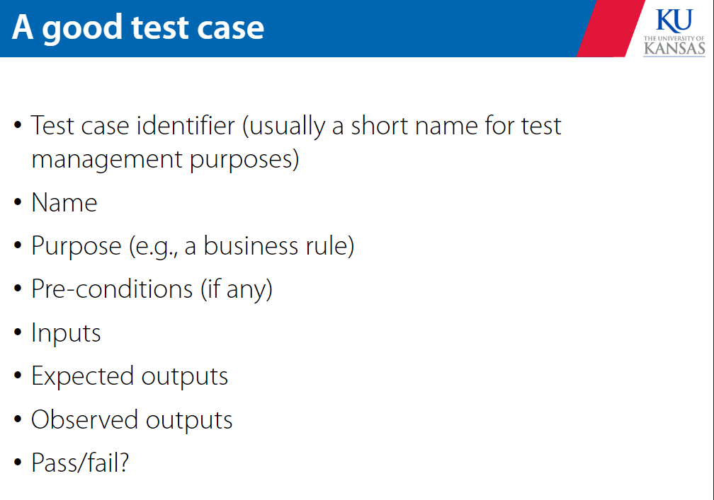
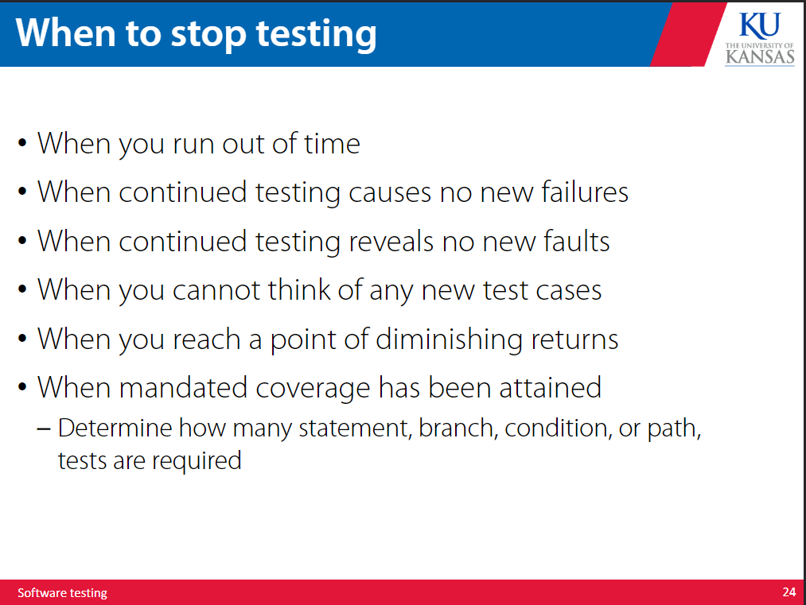
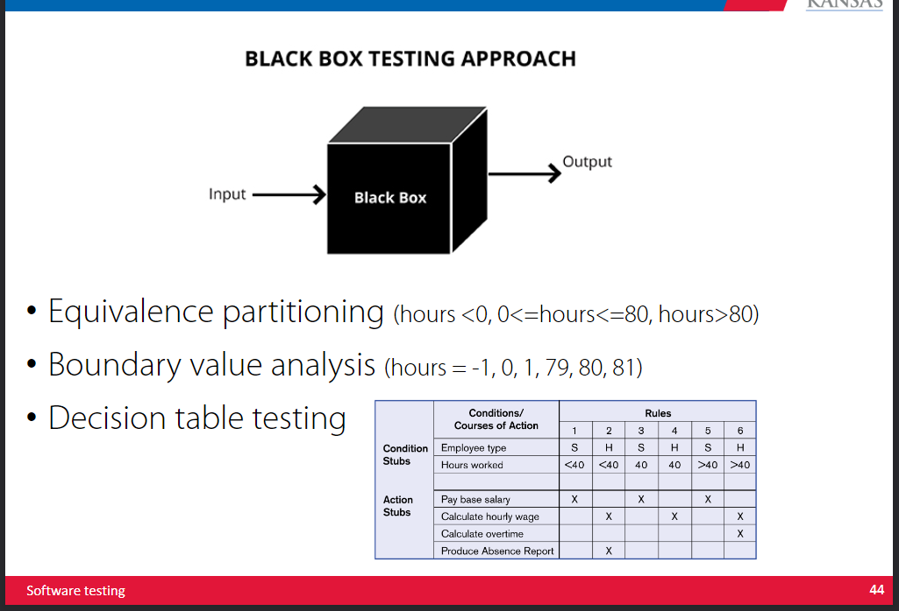
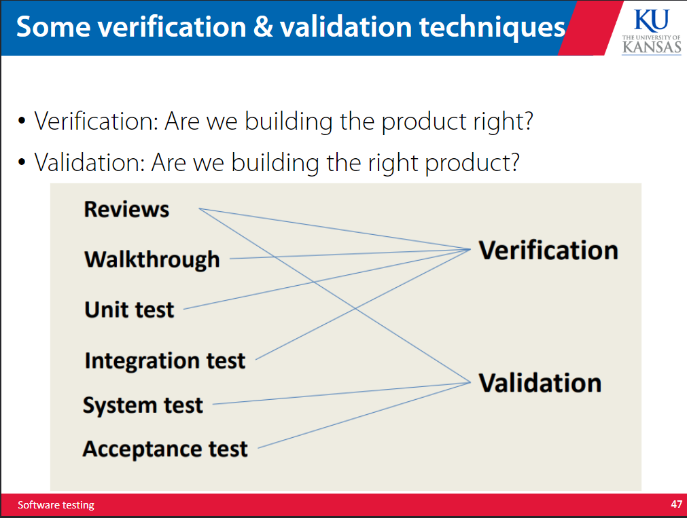
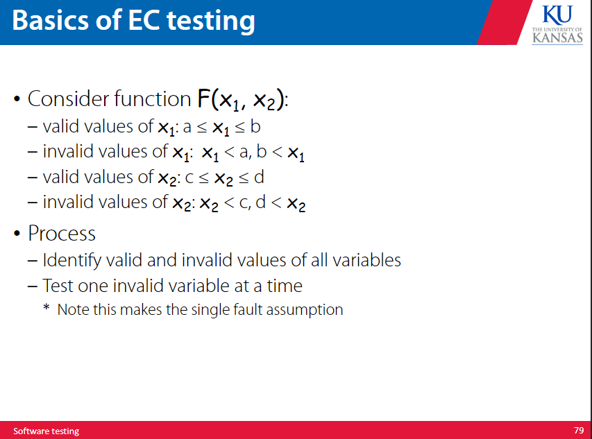
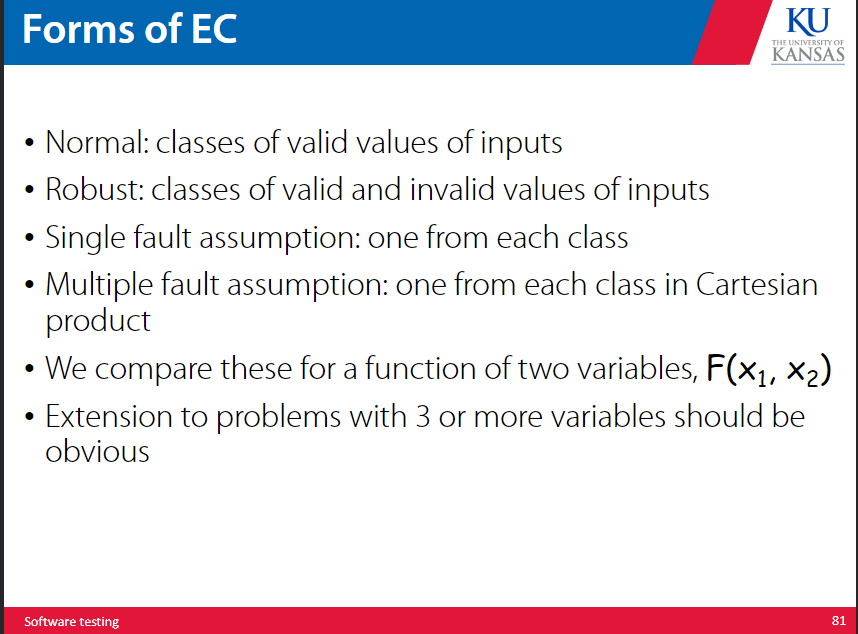
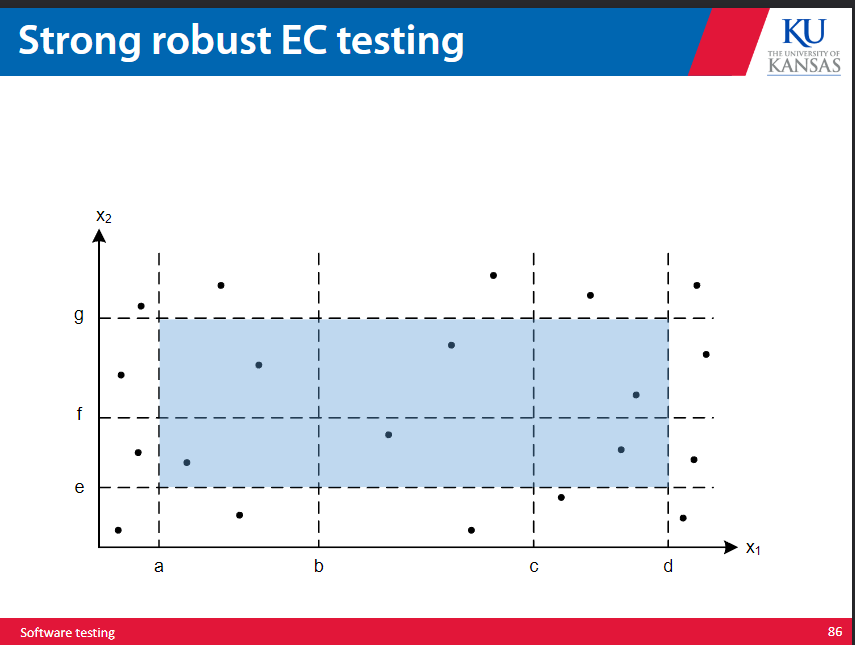

# software testing 

The objective of testing is to find the faults in a program. It is only considered successful if a fault is found. The process of determining what fault caused the failure is called fault identification. Fault correction is fixing faults. 

A fault is when a human makes an error in performing software. A failure is a departure from the required behavior of the software. 

Human error can lead to a fault that can lead to failure. 

Failure is when code coressponding to a fault executes. In essence, a failure is an executed fault that produces incorrect program behavior, and a fault is simply an unexpected code behavior. 

A test case has an ID that is associated with a certian program behavior. Test cases also have a set of inputs and expected outputs. A good test case will show us a failure. 

## types of testing 

Constructive testing is tests that are built to be passed, which intend to ensure the program works to minimum specifications. These are initial tests that do not punish the system and are to ensure that the system can do basic functions. 

Destructive testing is tests that are built to destroy the system to find faults. This is meant to test the software in every way possible. 

## ensuring quality software 

A good program will have done static and dynamic testing, formal specificiation and verification, technical reviews, sofware config management, project tracking and control, and metrics. 

## testing organization 

Multiple stages of testing:

- unit testing 
- function testing 
- integration testing 
- performance testing
- acceptance testing 
- installation testing 

The idea is to test each component with unit and function testing, test the integration of all the components with integration testing, test the entire system with performance testing, ensure it all works to term with acceptance testing, and then do installation testing to make sure it works on other systems. 

## test case generation 

Black box testing ( also referred to as specification testing or closed box testing or functional testing) checks the functionality of test objects and involves no view of the code or data structure -- it only looks at the input and output. 

White box testing ( also referred to as code based or clear box or glass box or structural testing) tests the structure of the test objects and provides an internal view of the code and data structures.
Essentially we can see the goings on of the code 

Black box testing is mostly to establish confidence in the behavior of the system. White box testing is mostly to seek faults. 

## code review 

Code walkthrough is where you present code and documentation to the team and the team tells you if it looks like there is anything wrong with it. 

Code inspection is where the code and documentation is checked against a list of predetermined concerns, and the efficiency and the correctness of the algorithms are evaluated. This is a more formalized process than code review. 

## how to write test cases 

We write assertions that describe iO conditions, generate theorems to be proven, develop assertions for all loops and conditionals, identify all pathways, ensure each pathway is checked and make sure the program terminates normally. 

When we choose test cases we determine the objectives of each test cases, select test cases that demonstrate code behavior, and define detailed execution instructions for the test. 

## quality control 

Reject anything that doesn't meet our quality standards. If it fails we go back to development. We ensure this goes smoothly through process and design standards defined at requirements and development. 

Quality assurance is more effective than quality control, because we ensure problems are resolved before and during the development process. We can improve the process to reduce defects on quality control checks. 

The cost to fix a bug goes up the later on in the development process it is. 

## black box testing 

Equivalance partitioning is when we group types of input into sets or classes so we can effectively test the same range of things with less actual test cases. 

Boundary value analysis is where we test at the boundaries of behavior to require less test cases. 

Decision table testing is where we create a table of possible types of inputs and generate test cases based upon this table. 

## white box testing 

Statement coverage is where you execute all statements of the source code at least once. 

Branch coverage is where you ensure every branch of all conditionals are run at least once. 

Condition coverage is where you check the variables and sub expressions in a conditional. 

Path coverage is where you execute all the possible paths of the code. 

Dataflow testing is where you see how data changes inside variables as the code is executed, monitoring it at each stage. (very similar to vs code debugger)

## debugging 

Debugging is the result of good testing. It is when you map issues to causes and investigate them to resolve bugs. 

We can find bugs by guessing but this isn't the most efficient solution and this generally resolves issues that are trivial in nature or imply obvious fixes. 

There are different stages to debugging:

- information collection
- fault confirmation 
- fault correction
- fault and correction 
- regression testing 
- documentation

These are a little self explanatory except for regression testing, which is when you test any changes made to fix a bug to ensure they did not produce any more bugs. 

### example questions 

Identify the fault in code:

Find where a line could produce a potential failure 

Identify a test case that does not execute the fault:

self explanatory, but ensure the code that contains the fault is just never run 

Identify a test case that executes the fault but does not a result in an error state:

let the code that contains the fault run but ensure it does not result in an error

Identify a test case that results in an error but not a failure:

ensure the code returns the correct end behavior but still does not do what it was supposed to do

Identify the first error state:

show the state of the program when the error is first triggered and why it is an error 

fix the fualt and verify that the given test produces the expected output:

self explanatory

### main spec based testing techniques 

- boundary value testing 
- equivalence partitioning 
- decision table based testing 
- fuzz testing ( random values )

most of these are either self explanatory or were explained earlier in the document, ctrl+F them 

## boundary testing 

it is impossible to check all iO combinations, so we should be checking things at their boundaries. We want to check for invalid values and make sure that any fault we discover is a singular fault caused by only one factor. 

We want to check both edges of each boundary for expected behavior and a random value in the middle of any two boundaries.
For n variables there are 4n+1 cases. 

We can also use beyond extreme values for the sake of 'robustness' using a 6n+1 formula for the number of cases, where we have added two more test cases per boundary. 

We should assume faults will not come to us in a singular fashion, and that we will have situations where multiple faults will arise at the same time. We should have 5^n test cases using the no single fault assumption. 

This is also known as worst case boundary value testing. If we are applying robust worst case bondary testing we follow a 7^n formula for the number of test cases. 

This is a relatively straightforward test case generation scheme that is easy to automate and generate. It may involve redundancies but is good for calculation intensive apps with variables that represent quantities. 

## equivalent class partitioning 

All variations of boundary value testing are vulnerable to testing gaps and redundancy. 

We can use an equivalence class to help this, as members of a class will always be treated the same and equivalence classes form partitions of types of inputs. 
Partitions deal with redundancy and gaps.

Essentially we do one of every theoretical test case combination within the conditional boundaries. 

### normal EC testing 

We need a test case for each side of each conditional. We are testing the equivalence of valid values. 

### robust ec testing 

we seek to identify the equivalence of all valid and invalid values. This way we can identify anything that is not behaving as expected. 

### non single fault normal ec testing 

we do not assume single fault, so we identify the equivalance of classes of all the valid values for each possible boundary case. (Each class set has to go through the iteration of all the other class sets.)

### non single fault robust ec testing 

consider invalid input without assuming single fault. we identify the equivalence of valid and invalid values for all classes combined. Detects faults from interactions between variables, and is the most rigorous form of EC testing. 

strong robust EC testing will look at every possible class domain. 

