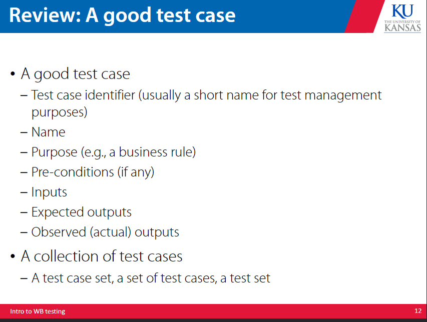
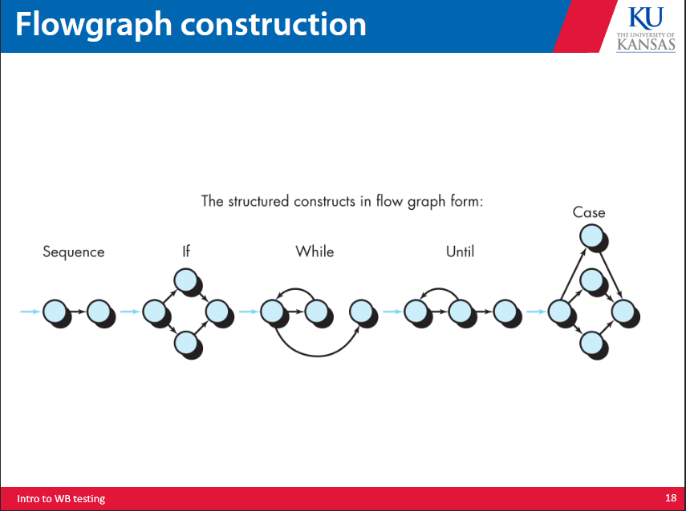
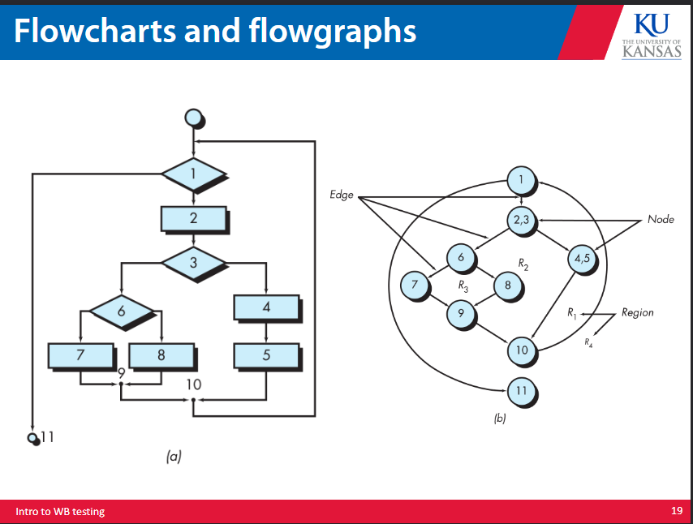

# white box testing 

This doc is mostly a continuation of the sw_testing document. A lot of it is examples as well so I suggest having the slides open while you go over it.

Coverage criteria: rules or requirements a test set has to satisfy.

Subsumption: a relation between two test set requirements, basically does one set subsume another, where C1 subsumes C2 iff every C1 test cases fulfills all of C2s requirements. Does not imply they are subsets.

## code based structural testing 

Control flow based testing is when you make a graph that shows the flow of control, and you make test cases that test every node,edge, branch, and path of this graph. 
This way we can test every facet of the control flow. 

### statement testing 
Test each node in the control flow graph, ensure each statement is executed. This kind of a weak coverage, and insensitive to some control structures. 
### branch testing 
Test each edge in the graph, ensures all boolean expressions in the control flow are tested. The entire expression needs to be expressed as a True or False. 
### condition testing 
Test each conditional in the graph, this means every boolean subexpression seperated by an and/or subexpression. This is like branch testing but is more sensitive to control flow. Does not necessarily create full branch testing. 
### compound condition testing 
Test each conditional in a multiplicative fashion ie every variation of all conditionals. We get the test cases from the logical operator truth table of every condition. 
This essentially does both condition testing and branch testing at the same time. 

Some of these test cases might be extraneous, and it is tedious to figure out the minimum set of test cases required. It involves a huge number of test cases (2^n) created with a multiple compound combinatoric scheme. 
This gets wildly impractical the greater n is. 

For some reason this is a standard for avionics software (designed at boeing).

### modified condition decision coverage testing 
Ensure that each condition in a decision actually affects the outcome, does variating just this condition while holding all other conditions constant change anything. For each condition find two rows in the decision table where the condition changes and the outcome changes while other conditions remain the same. 

We are still effectively doing compound condition testing while we do this, so we are checking all possible true and false combinations on all conditions. 

The goal of this is to make sure every decision has taken all possible outcomes at least once, and that every condition independently affects the outcome. We only really consider n+1 test cases, as compound condition will call for 2^n test cases where MCDC calls for n+1 test cases. 

Generally the idea here is to strike a balance between branch and compound condition coverage. 

Subsumes branch, condition, statement, and decision coverage but is subsumed by compound condition coverage. 

### path testing 
Test each path in the graph 

### dataflow coverage 
Check statements where variables receive values and where they are used and referenced (functions somewhat similarly to the vscode debugger variable value tracking)

## subsumption 

Relatively complicated concept, essentially boils down to the idea that as long as one set hits all the requirements of the other set we can do the first set without having to do the second. 

This has to be true for all test cases.

Look at the slides/google for more on this.

## flowgraphs 

# examples 

Everything from here on out is examples, legit just read the slides, but i will put explanations for anything i think needs it. 

